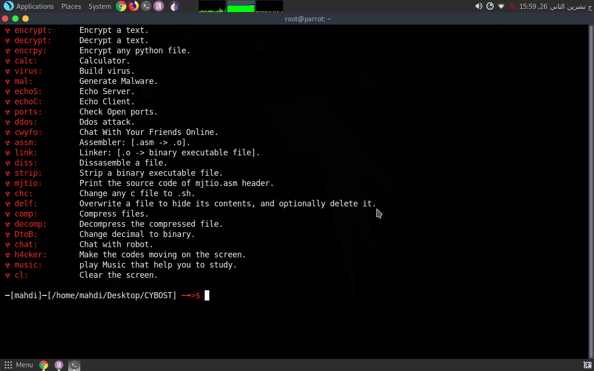

# This tool is under development
 I developed this tool at 12 Nov 2021,I was 15 years old!
 
 This toolkit coded by Mr MJT [Mahdi] only..

# How to use the tool:
clone this software to your linux by typing:

git clone https://github.com/Mr6MJT/CYBOST

then

cd CYBOST

bash setup
# this software not for termux users. 

# for whom this tool?
This tool will help basic social engineers,linux users,cyber security students

# What you can do by this tool?

$-build virus.

$-ecnrypt text.

$-decrypt text.

$-ecrypt python file.

$-Overwrite a file to hide its contents, and optionally delete it.

$-strip a binary file.

$-.asm -> .o

$-.o -> binary executable file.

$-dissassemble a file.

$-echo server.

$-chat with your friends online.

$-generate malware [soon].

$-check open ports [soon].

$-ddos attack [soon].

# it's easy to use
you can use this tool easily

# Stop Wishing,Start Doing
I am Mahdi,a 15-years-old cyber security student,with a computer[2 gb ram and dead battery] and i was able to learn and to program this "simple" tool,you also can learn and work,to become the person you want,No matter how old are you,just NEVER GIVE UP!

# screenshots:

