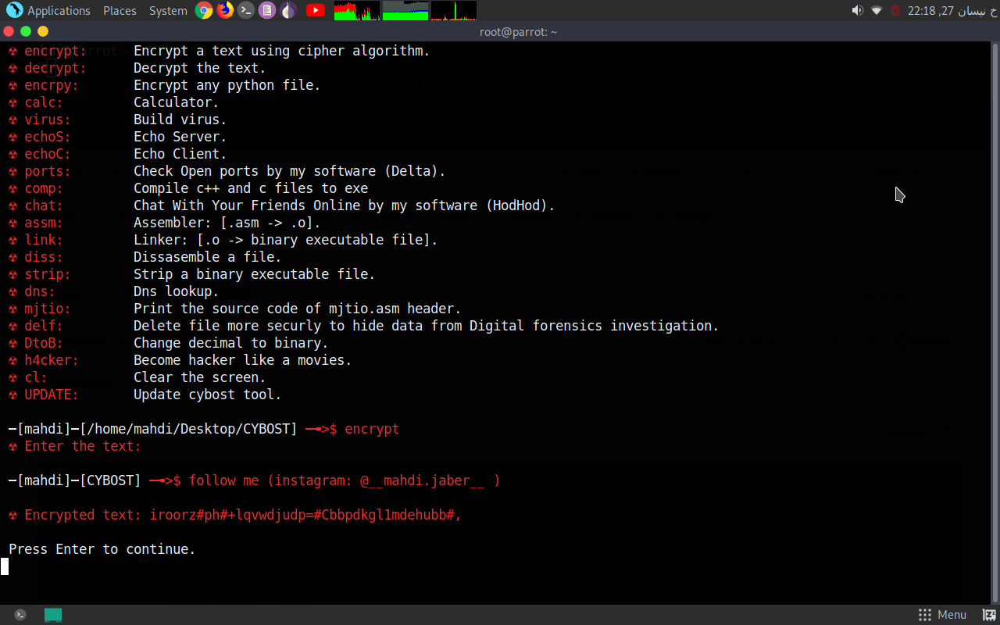

# Hello World!

 I developed this tool at 12 Nov 2021.
 
 This toolkit coded by Mr MJT [Mahdi Jaber] only..

# How to use the tool:
clone this software to your linux by typing:

<pre> $~ git clone https://github.com/Mr6MJT/CYBOST </pre>

then

<pre> $~ cd CYBOST </pre>

<pre> $~ bash setup </pre>

# for whom this tool?
This tool will help basic Social Engineers, Linux Users, Cyber Security Students and every person who wannabe Ethical Hacker.

# What you can do by this tool?

<pre> $~ Build virus. </pre>

<pre> $~ Encrypt text using cipher algorithm. </pre>

<pre> $~ Decrypt the text.</pre>

<pre> $~ Encrypt python file.</pre>

<pre> $~ Overwrite a file to hide its contents, and optionally delete it.</pre>

<pre> $~ Strip a binary file.</pre>

<pre> $~ Compile .asm file -> .o</pre>

<pre> $~ Compile .o file -> binary executable file.</pre>

<pre> $~ Dissassemble a file.</pre>

<pre> $~ Echo server.</pre>

<pre> $~ Chat with your friends online.</pre>

<pre> $~ Check open ports.</pre>

# it's easy to use
you can use this tool easily.

# screenshots:

# encrypting text:

# creating chat room:

# chating..

